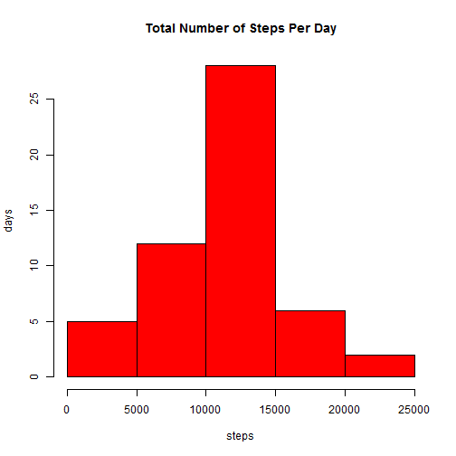

  
## Loading and preprocessing the data
  
### Load the data

Load relevant packages for the assignment:

```r
library(lattice)
```


Define the url, the name of the zip file, and the name of the data file:

```r
url <- "https://d396qusza40orc.cloudfront.net/repdata%2Fdata%2Factivity.zip"
zipFile <- "data.zip"
fileName <- "activity.csv"
```


If the data source file activity.csv is not in the current directory, download and unzip the source file from the url:

```r
if (!file.exists(fileName))
{
  download.file(url, zipFile)
  unzip(zipFile)
}
```


Read (and format) the data from the data source file: 

```r
data <- read.csv("activity.csv"
                 , colClasses = c("numeric", "Date", "numeric")
                 , na.strings = "NA")
```


Check the contents of the data:

```r
head(data)
```

```
##   steps       date interval
## 1    NA 2012-10-01        0
## 2    NA 2012-10-01        5
## 3    NA 2012-10-01       10
## 4    NA 2012-10-01       15
## 5    NA 2012-10-01       20
## 6    NA 2012-10-01       25
```

----------  

## What is the mean total number of steps taken per day?


### Calculate total number of steps per day

Create a new data frame that sums the total number of steps by day:

```r
steps.day <- aggregate(data$steps ~ data$date, FUN=sum, na.rm=TRUE)
names(steps.day) <- c("date", "steps")
```

### Make a histogram

Plot the data in a histogram:

```r
with( steps.day, 
      hist(steps.day$steps
           , main = "Total Number of Steps Per Day"
           , xlab = "steps"
           , ylab = "days"
           , col = "red"
           )
    )
```

 


### Calculate the mean and median

Get a summary of the data to obtain the mean and median: 

```r
summary(steps.day$steps)
```

```
##    Min. 1st Qu.  Median    Mean 3rd Qu.    Max. 
##      41    8841   10760   10770   13290   21190
```

The mean for the total number of steps per day is 10770.
The median for the total number of steps per day  is 10770.

----------  

## What is the average daily activity pattern?

### Make a time series plot of the 5 minute interval and average number of steps taken across all days:

Create a new data frame that averages the number of steps by interval:

```r
steps.interval <- aggregate(data$steps ~ data$interval, FUN=mean, na.rm=TRUE)

names(steps.interval) <- c("interval", "steps")
```


Plot the average number of steps by interval 

```r
with( steps.interval
      , plot( interval
              , steps
              , type = 'l'
              , main = "Average Steps by Interval"
              , xlab = "interval"
              , ylab = "average steps"
              )
)
```

 


### Which 5-minute interval contains the maximum number of steps

Find the the interval with the max number of steps: 

```r
steps.interval[ steps.interval$steps == max( steps.interval$steps), ]
```

```
##     interval    steps
## 104      835 206.1698
```

The interval with highest average number of steps is 835.


----------  

## Imputing missing values


### Calculate the total number of missing values

Find the number of rows with missing values:

```r
length(data$steps[is.na(data$steps)])
```

```
## [1] 2304
```

There are 2304 data points with NA values.


### Develop a strategy for imputing the data 


Create a dataframe with only NA values:

```r
nas <- data[is.na(data$steps), ]
```


Impute the missing values by replacing NAs with the average number of steps for the interval: 

```r
for ( i in 1:nrow(nas)) {
    
    nas[i, "steps"] <- 
        steps.interval[ steps.interval$interval == nas[i, "interval"], "steps"]
  
}  
```


### Create a new dataset with missing values filled in

Create a dataframe from the original dataset with no NA values:

```r
val <- data[!is.na(data$steps), ]
```

Combine the dataframe with NA values imputed and the dataframe without NA values to create a newdataset with no NAs:

```r
newdata <- rbind(val, nas)
```


### Plot a hisogram of total number of steps taken each day and fine the mean and median

Group the new dataset by day:

```r
newsteps.day <- aggregate(newdata$steps ~ newdata$date, FUN=sum, na.rm=TRUE)

names(newsteps.day) <- c("date", "steps")
```


Plot the data in a histogram:

```r
with( newsteps.day, 
  hist(newsteps.day$steps
      , main = "Total Number of Steps Per Day"
      , xlab = "steps"
      , ylab = "days"
      , col = "red")
)
```

 


Get a summary of the new data set to obtain the mean and median:

```r
summary(newsteps.day)
```

```
##       date                steps      
##  Min.   :2012-10-01   Min.   :   41  
##  1st Qu.:2012-10-16   1st Qu.: 9819  
##  Median :2012-10-31   Median :10766  
##  Mean   :2012-10-31   Mean   :10766  
##  3rd Qu.:2012-11-15   3rd Qu.:12811  
##  Max.   :2012-11-30   Max.   :21194
```
  
The mean for the total number of steps per day is 10766.
The median for the total number of steps per day  is 10766.
  
The mean is the same.
The median (10766) is one off from the original mean (10765).
  
Imputing the data does not have a significant impact on the estimates of the 
total number of steps per day.
  
  
----------  
  
## Are there differences in activity patterns between weekdays and weekends?
  
  
### Create a new factor variable 
  
Create the a factor called weekend: 

```r
newdata <- transform(newdata
                     , weekdays = factor( 
                         ifelse( 
                             weekdays(date) %in% c("Saturday","Sunday")
                                 , "weekend"
                                 , "Weekday" 
                                 )
                         )
                     ) 
```
  
  
### Make a panel plot of time series plots for the average number of steps per day grouped by weekday vs weekend
  
Create a dataframe to find average number of steps by weekend and interval:

```r
wk.interval <- aggregate(newdata$steps
                         , by=list(newdata$weekdays, newdata$interval)
                         , FUN=mean
                         , na.rm=TRUE)

names(wk.interval) <- c("weekdays", "interval", "steps")
```
  
  
Create a panel plot using the lattice plotting system:

```r
xyplot( steps ~ interval | weekdays
        , data = wk.interval
        , type = 'l'
        , layout = c(1, 2))
```

 

